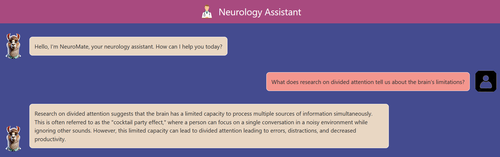
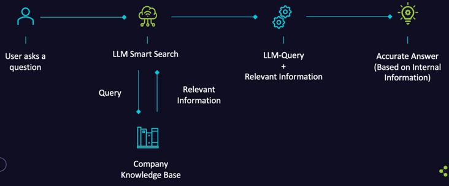
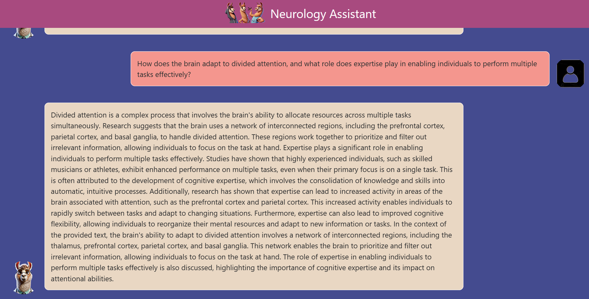

# RAG for chatbot - Llama Neurology assistant 🦙🧠💬

    

# Introduction

I’ve been working on a small project: a Retrieval Augmented Generation (RAG)-based “Neurological Assistant” 🧠 that uses Meta’s [LLaMA 3.2 (3B)](https://ai.meta.com/blog/llama-3-2-connect-2024-vision-edge-mobile-devices/) model as its text generator. To power it up with real knowledge, I’m using the “all-MiniLM-L6-v2” sentence transformer to create embeddings from some books in PDF form on the human brain, cognition, and behavior. All these embeddings get stashed in a [Pinecone](https://www.pinecone.io/) vector database 🌲, so the assistant can fetch the info it needs whenever it’s stuck on a tough question. On top of that, I’ve also rolled out a user interface 💻 to make the whole thing more user-friendly. Now, instead of just a command-line tool, you’ve got a neat, interactive way to chat and learn.

The idea is to:  

✅ Turn complex neuroscience books into friendly conversations, making exploration less intimidating and more fun.  
✅ Foster interactive, engaging learning that helps you absorb and recall information faster.  
✅ Quickly retrieve learned knowledge to deepen understanding and connect new ideas.  
✅ Transform passive reading into a two-way dialogue, encouraging curiosity and insight.  
✅ Ensure complete privacy: Locally deployed, so your questions and data stay with you and are never stored by others.🛡️  
✅ Customize learning: Tailor the assistant to your specific interests, topics, or data for a more personalized experience.🎯  

Want to build your own chatbot to assist with reading and learning? 📚
Whether it’s tackling complex topics 🧠, organizing daily tasks ✅, or exploring areas of interest 🔍, a RAG-powered assistant can make knowledge more accessible and practical.

For full installation instructions, see INSTALL.md. 🚀

# RAG

    
    
Source: <a href="https://valueminer.eu/de/retrieval-augmented-generation-rag" target="_blank">ValueMiner - Retrieval Augmented Generation (RAG)</a>

Retrieval-Augmented Generation (RAG) is an AI framework that combines retrieval-based methods with generative models. It retrieves relevant external knowledge (e.g., documents) to improve the quality, accuracy, and reliability of generated responses.

Use Cases:  
    ✅ Question Answering: Providing accurate answers based on retrieved documents.  
    ✅ Customer Support: Query resolution using product manuals or FAQs.  
    ✅ Educational Tools: Summarizing textbooks or academic resources.  
    ✅ Knowledge Assistants: Assisting professionals with real-time information retrieval.  

RAG enhances generative AI by grounding outputs in up-to-date, factual information.

# Challenges and Optimizations

This is a small project I implemented in a short time to learn about RAG (Retrieval-Augmented Generation) 🧠, so there’s still room for improvement. If you plan to use this, I recommend modifying or enhancing some methods ✨ to improve the quality of the “Answer” generated by LLaMA 3.2 on the UI 🖥️.

For instance, I attempted to implement short-term conversation memory (commented in the app.py script) 💬 to make the conversation smoother and more contextually connected. However, I still encountered challenges due to the Prompt Template I used.
For example: 
    User: "what is acne?"
    Bot: "Acne is ..."
    User: "How to prevent that?"
    Bot: "(make no sense answer - Although the memory are there)"
🛠️ Incorporating better text extraction techniques 📄 or advanced analysis methods could further refine the answers.

Another promising approach is thought chaining 🔗 to produce more accurate responses. However, this increases inference time ⏳ significantly. On my setup with 16GB RAM and an NVIDIA GTX 1080 Ti (6GB) 🖥️, generating a single complete answer takes 3-4 minutes ⏱️. This makes it difficult to implement chaining or introduce an answer evaluator (judger) 🧐.

When testing on a system with an NVIDIA RTX A4000 ⚡, inference time dropped to 2-3 seconds per answer 🚀. Depending on your hardware, you might want to consider using a smaller or larger model to balance performance ⚖️ and accuracy 🎯.
 

⚠️ Prompt:  
1. Improve the Quality of Responses: To generate better answers, add more data to your vector database. Ensure the data is relevant to the subject your chatbot is designed for. For example, if your chatbot focuses on brain health, include documents related to neurology, clinical psychology, or brain-related research.

2. Customize the Prompt Template: Modify the prompt_template files (1, 2, 3) located in src/prompt.py to suit your chatbot's desired role.  
For instance, you can instruct the chatbot to:
    "Act as a teacher explaining complex topics."
    "Act as a monk offering wisdom and guidance."
    "Act as a financial advisor providing investment tips."
Tailoring the prompt to your chatbot’s role will enhance its ability to deliver contextually accurate and meaningful responses.

⚠️ Prompt Extractor
The [Llama3.2-3B-Instruct](https://huggingface.co/meta-llama/Llama-3.2-3B-Instruct) model performs really well when integrated into a RAG-based system. However, the output always includes:  
    The original Prompt_Template provided,
    The retrieval context, and
    Automatically generated questions and answers.

This behavior causes the model to go beyond answering the user's query, resulting in verbose or unwanted outputs. To address this, I implemented a prompt extractor that cleans and refines the model's output to improve the results displayed on the UI.  
Important: Depending on your project requirements, you may need to customize or enhance this extractor to better suit your use case and deliver cleaner responses.

# Some conversations

Thêm ảnh dô

    

# Installation
---

For full installation instructions, see [INSTALL.md](INSTALL.md).

