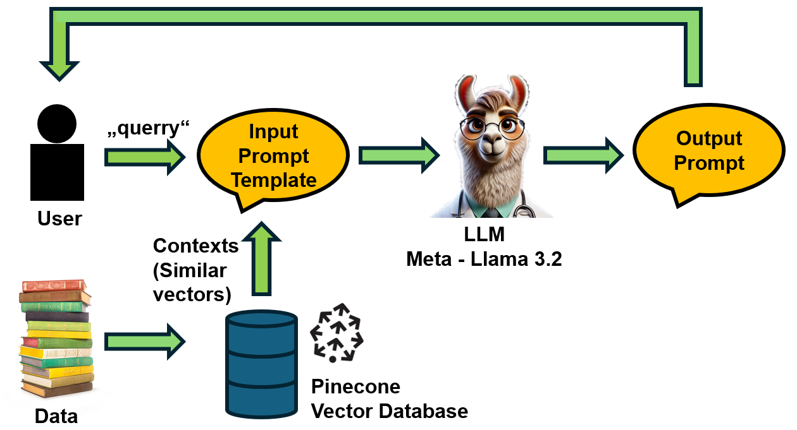

# RAG for chatbot - Llama Neurology assistant 🧠💬➕🏥

    

# Introduction
---

I’ve been working on a small project: a Retrieval Augmented Generation (RAG)-based “Neurological Assistant” 🧠 that uses Meta’s [LLaMA 3.2 (3B)](https://ai.meta.com/blog/llama-3-2-connect-2024-vision-edge-mobile-devices/) model as its text generator. To power it up with real knowledge, I’m using the “all-MiniLM-L6-v2” sentence transformer to create embeddings from some books in PDF form on the human brain, cognition, and behavior. All these embeddings get stashed in a [Pinecone](https://www.pinecone.io/) vector database 🌲, so the assistant can fetch the info it needs whenever it’s stuck on a tough question. On top of that, I’ve also rolled out a user interface 💻 to make the whole thing more user-friendly. Now, instead of just a command-line tool, you’ve got a neat, interactive way to chat and learn.

The idea is to:
    ✅ Turn complex neuroscience books into friendly conversations, making exploration less intimidating and more fun.
    ✅ Foster interactive, engaging learning that helps you absorb and recall information faster.
    ✅ Quickly retrieve learned knowledge to deepen understanding and connect new ideas.
    ✅ Transform passive reading into a two-way dialogue, encouraging curiosity and insight.
    ✅ Ensure complete privacy: Locally deployed, so your questions and data stay with you and are never stored by others. 🛡️
    ✅ Customize learning: Tailor the assistant to your specific interests, topics, or data for a more personalized experience. 🎯

Want to build your own chatbot to assist with reading and learning? 📚
Whether it’s tackling complex topics 🧠, organizing daily tasks ✅, or exploring areas of interest 🔍, a RAG-powered assistant can make knowledge more accessible and practical.

For full installation instructions, see INSTALL.md. 🚀

# RAG 
(Definition + Usecase)

    
    
Source: <a href="https://valueminer.eu/de/retrieval-augmented-generation-rag" target="_blank">ValueMiner - Retrieval Augmented Generation (RAG)</a>

Retrieval-Augmented Generation (RAG) is an AI framework that combines retrieval-based methods with generative models. It retrieves relevant external knowledge (e.g., documents) to improve the quality, accuracy, and reliability of generated responses.
Use Cases:

    Question Answering: Providing accurate answers based on retrieved documents.
    Customer Support: Query resolution using product manuals or FAQs.
    Educational Tools: Summarizing textbooks or academic resources.
    Knowledge Assistants: Assisting professionals with real-time information retrieval.

RAG enhances generative AI by grounding outputs in up-to-date, factual information.

# Project Implementing, Pros and cons

...Definition what's RAG, structure + usecases

## Installation
---

For full installation instructions, see [INSTALL.md](INSTALL.md).

